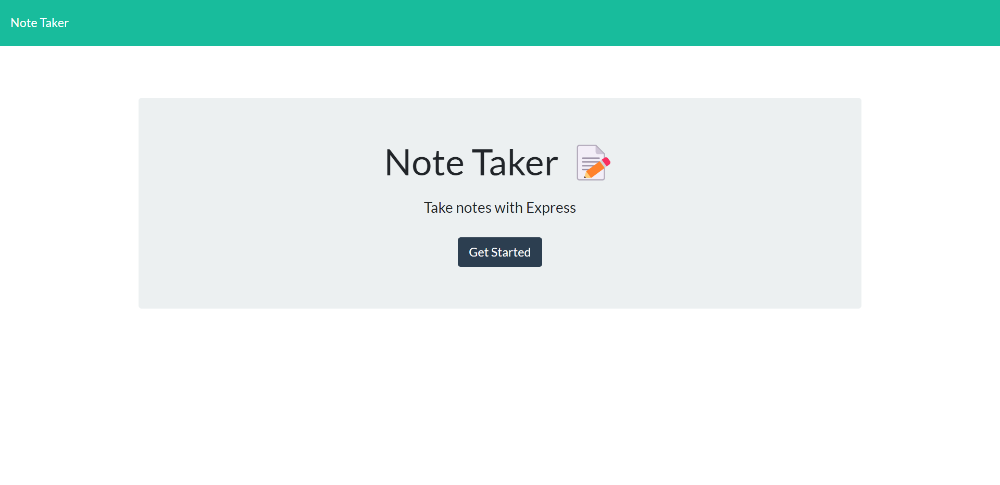
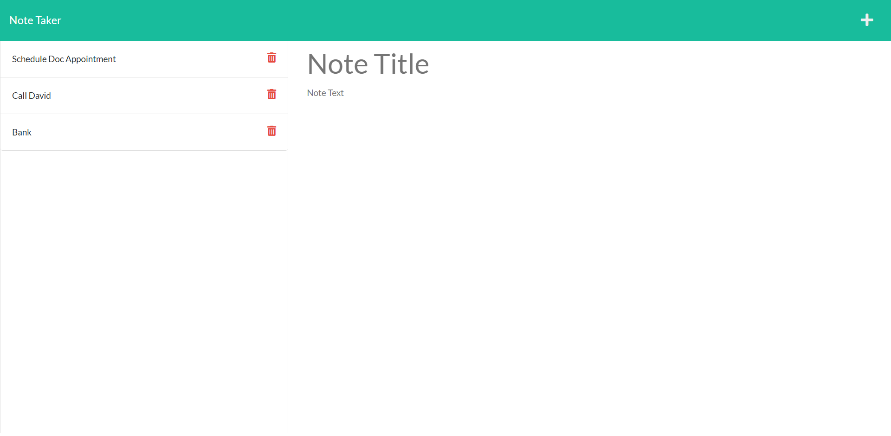

# note-taking-app

## Description

The Note Taking Application allows users to save and store impotant notes. Users can add and revisit notes and reminders that the app saves into a database. 

## Installation

To install or deploy the Note Taking App click [this link](https://lp-note-taking-app.herokuapp.com/notes)!

## Usage

Users are pesented a home page : 

Once 'Get Started' is clicked users are taken to the note-taking app where their daily reminders and be written and saved :

## Credits
https://stackoverflow.com/questions/29884654/button-that-refreshes-the-page-on-click
https://blog.logrocket.com/reading-writing-json-files-nodejs-complete-tutorial/
https://www.npmjs.com/package/uniqid/v/5.1.0

